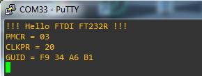
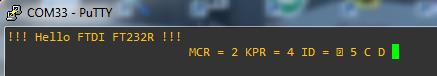

LGT8FX8P ISP programmer using FT232R in bitbanging mode.

**ATTENTION:**  this is not a working version; try it on your own risk.

When the test program (HEX format) flashed with the bootloader or the LGTISP here's the result:

When converted to BIN and flashed with the FT232R here's the result:

The PB5 LED blinks as expected in the two cases.

Can some one, please, geuss what's going wrong in the 2nd case (using FT232R)? 

=========================================================

Resources:

https://github.com/LGTMCU/LarduinoISP

https://github.com/nicechao/ISP4LGT8F328P

https://oshwhub.com/brother_yan/LGTISP

https://github.com/SuperUserNameMan/LGTISP

